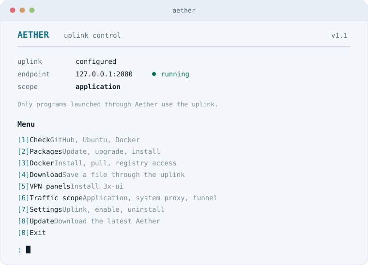
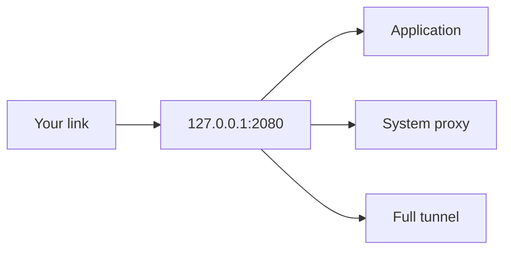

<p align="center">
  <a href="#english">English</a>
  &nbsp;&nbsp;·&nbsp;&nbsp;
  <a href="#fa">فارسی</a>
</p>

<a id="english"></a>

# Aether

<p align="center">
  Uplink control for Linux.<br>
  One link you already have. A terminal that knows what to do with it.
</p>

<p align="center">
  <picture>
    <source media="(prefers-color-scheme: dark)" srcset="docs/readme/terminal-dark.svg">
    
  </picture>
</p>

<p align="center">
  <a href="LICENSE"></a>
  
  <a href="https://github.com/SagerNet/sing-box"></a>
  <a href="https://github.com/BemoBit/Aether/releases"></a>
</p>

<p align="center">
  <a href="#install">Install</a>
  &nbsp;·&nbsp;
  <a href="#scopes">Scopes</a>
  &nbsp;·&nbsp;
  <a href="#links">Links</a>
  &nbsp;·&nbsp;
  <a href="#menu">Menu</a>
  &nbsp;·&nbsp;
  <a href="#commands">Commands</a>
  &nbsp;·&nbsp;
  <a href="#fa">فارسی</a>
</p>

Aether is uplink control for a Linux server. You bring an HTTP, SOCKS, VLESS, VMess, Trojan, or Shadowsocks link. Aether runs it through [sing-box](https://github.com/SagerNet/sing-box) 1.14.2 on `127.0.0.1`, then opens a terminal menu for the jobs that stall when GitHub, Docker Hub, or the Ubuntu archive is hard to reach: package installs, image pulls, file downloads, and the official 3x-ui installer. Release 1.1.

<a id="install"></a>

## Install

```bash
curl -fsSL https://raw.githubusercontent.com/BemoBit/Aether/main/install.sh | sudo bash
sudo aether
```

Read [`install.sh`](install.sh) before you pipe it to a shell. `ae` is a shortcut for `aether` when that name is free.

From a checkout of this repository:

```bash
sudo bash install.sh
sudo aether
```

The installer downloads sing-box for `amd64` or `arm64`. If GitHub is unreachable, place a sing-box binary at `/usr/local/lib/aether/sing-box` and run `sudo aether` again.

Package commands and the Docker apt repository need Debian or Ubuntu. The uplink service needs systemd. On any other systemd distribution, the proxy and the full tunnel are the parts that run. Aether says so when a menu action needs apt.

<a id="scopes"></a>

## Scopes



| Scope | Command | What crosses the uplink |
| --- | --- | --- |
| Application | `aether scope tool` | Programs Aether launches, and `aether exec`. This is the default. |
| System proxy | `aether scope system` | The application scope, plus programs that honor `http_proxy`, `https_proxy`, and `all_proxy`. apt is included. |
| Full tunnel | `aether scope tunnel` | Outbound traffic from the server, including programs that ignore proxy settings. |

Full tunnel keeps a direct route for the current SSH client when `SSH_CONNECTION` is set. If the server stops answering, open the console and run:

```bash
sudo aether scope tool
```

Enabling the full tunnel from a script needs an explicit confirmation:

```bash
sudo AETHER_ASSUME_YES=1 aether scope tunnel
```

<a id="links"></a>

## Links

Paste a share link, or enter an HTTP or SOCKS proxy as host, port, and an optional login.

| Link | What Aether accepts |
| --- | --- |
| HTTP / HTTPS | `http://host:port`, optional username and password |
| SOCKS | `socks5://`, `socks4://`, `socks4a://` |
| VLESS | TCP, WebSocket, gRPC, HTTP, HTTPUpgrade, QUIC. TLS and Reality, including `xtls-rprx-vision` on TCP |
| VMess | Standard `vmess://` links |
| Trojan | `trojan://` |
| Shadowsocks | SIP002 and the legacy base64 form |

XHTTP, SplitHTTP, and mKCP are refused up front. The bundled sing-box build does not implement them.

<a id="menu"></a>

## Menu

| | Action |
| --- | --- |
| 1 | Check GitHub, the Ubuntu archive, and the Docker registry |
| 2 | Update package lists, upgrade, or install one package |
| 3 | Install Docker, pull an image, or toggle the daemon proxy |
| 4 | Download a file through the uplink |
| 5 | Install 3x-ui (Sanaei) from the official installer |
| 6 | Choose application, system proxy, or full tunnel |
| 7 | Status, change the uplink, enable, disable, uninstall |
| 8 | Update Aether from GitHub |
| 0 | Exit |

The first run asks for an uplink before the menu. Settings can replace it later.

<a id="commands"></a>

## Commands

```bash
sudo aether
sudo aether status
sudo aether check
sudo aether on
sudo aether off
sudo aether scope tool
sudo aether scope system
sudo aether scope tunnel
sudo aether set 'vless://...'
sudo aether parse 'vless://...'
sudo aether exec -- curl -I https://example.com
sudo aether update
sudo aether version
```

`aether parse` prints the server, port, security, and transport. It does not print passwords, UUIDs, or keys.

<details>
<summary>What each scope writes</summary>

Application mode starts the local sing-box service.

System proxy also writes:

- `/etc/profile.d/aether.sh`
- `/etc/apt/apt.conf.d/80aether`
- a marked block in `/etc/environment`

Open a new login shell before expecting every program to see the new variables. Services that are already running do not pick them up. Docker has its own switch in the Docker menu, because the daemon ignores a user's environment.

Full tunnel adds an `aether0` interface and routes outbound traffic through it. Private destinations stay direct. sing-box resolves the uplink host with the system resolver and resolves other destinations through the uplink. When `nft` is installed, `auto_redirect` is turned on so forwarded traffic, including Docker, follows the tunnel. If that start fails, Aether retries once without it.

</details>

<details>
<summary>Paths</summary>

| Path | Role |
| --- | --- |
| `/usr/local/bin/aether` | Command |
| `/usr/local/bin/ae` | Shortcut |
| `/usr/local/lib/aether/` | Program, libraries, sing-box binary |
| `/etc/aether/config.env` | Saved uplink, mode 600 |
| `/etc/aether/sing-box.json` | Generated engine config, mode 600 |
| `/var/lib/aether/` | Baseline of Docker settings, taken before Aether changes them |
| `/var/log/aether.log` | Short action log |

</details>

<details>
<summary>Uninstall</summary>

From Settings, or:

```bash
sudo bash /usr/local/lib/aether/uninstall.sh
sudo bash /usr/local/lib/aether/uninstall.sh --purge
sudo bash /usr/local/lib/aether/uninstall.sh --no-restore
```

`--purge` also removes the saved uplink, the Docker baseline, and the log. `--no-restore` leaves Docker's daemon settings and the system proxy files where they are.

</details>

<details>
<summary>Limits</summary>

- The share link is stored on disk. The config directory is mode 700 and the file is mode 600.
- The local proxy binds to `127.0.0.1` only. If it ever listens on a public address, Aether stops it.
- The first package install, and only that install, can temporarily point DNS at Shecan (`178.22.122.100`, `185.51.200.2`) and an ArvanCloud mirror when apt cannot be reached directly. The previous resolver and apt sources are put back afterwards.
- 3x-ui is installed by the upstream project's own installer. Aether downloads it and passes a release tag.

</details>

<details>
<summary>Tests</summary>

```bash
python3 -m unittest tests/test_link.py
```

The parser tests need no root access and no network. `sudo ./aether` from a checkout uses that checkout's code and the system paths under `/etc/aether`.

</details>

<a id="fa"></a>

<div dir="rtl">

<h2>فارسی</h2>

<p align="center">
  <a href="#english">English</a>
</p>

<p align="center">
  <picture>
    <source media="(prefers-color-scheme: dark)" srcset="docs/readme/terminal-dark.svg">
    
  </picture>
</p>

Aether کنترل آپ‌لینک برای سرور لینوکس است. لینک HTTP، SOCKS، VLESS، VMess، Trojan یا Shadowsocks را که خودتان دارید، از راه <a href="https://github.com/SagerNet/sing-box">sing-box</a> نسخه 1.14.2 روی <code dir="ltr">127.0.0.1</code> اجرا می‌کند و منویی در ترمینال باز می‌کند. نسخهٔ فعلی 1.1 است.

برای سروری است که نصب بسته، دریافت ایمیج Docker، یا دانلود از GitHub گیر می‌کند. از داخل منو می‌شود فهرست بسته‌ها را به‌روز کرد، Docker نصب کرد، فایل دانلود کرد، و نصب‌کنندهٔ رسمی 3x-ui را اجرا کرد.

<h3>نصب</h3>

<pre dir="ltr"><code>curl -fsSL https://raw.githubusercontent.com/BemoBit/Aether/main/install.sh | sudo bash
sudo aether</code></pre>

<p>پیش از اجرای این دستور، <a href="install.sh"><code dir="ltr">install.sh</code></a> را بخوانید. اگر نام <code dir="ltr">ae</code> روی سیستم آزاد باشد، میانبر <code dir="ltr">aether</code> است.</p>

<p>از روی کلون همین مخزن:</p>

<pre dir="ltr"><code>sudo bash install.sh
sudo aether</code></pre>

<p>نصب‌کننده sing-box را برای <code dir="ltr">amd64</code> یا <code dir="ltr">arm64</code> می‌گیرد. اگر سرور به GitHub نمی‌رسد، فایل اجرایی sing-box را در <code dir="ltr">/usr/local/lib/aether/sing-box</code> بگذارید و دوباره <code dir="ltr">sudo aether</code> را اجرا کنید.</p>

<p>دستورهای بسته و مخزن apt داکر به دبیان یا اوبونتو نیاز دارند. خود سرویس لینک به systemd نیاز دارد. روی توزیع دیگری که systemd دارد، پروکسی و تونل کامل کار می‌کنند. هر جا منو به apt نیاز داشته باشد، خودش می‌گوید.</p>

<h3>سه حالت ترافیک</h3>

<table>
  <thead>
    <tr>
      <th>حالت</th>
      <th>دستور</th>
      <th>چه ترافیکی از لینک رد می‌شود</th>
    </tr>
  </thead>
  <tbody>
    <tr>
      <td>برنامه</td>
      <td><code dir="ltr">aether scope tool</code></td>
      <td>فقط برنامه‌هایی که خود Aether اجرا می‌کند، و <code dir="ltr">aether exec</code>. این حالت پیش‌فرض است.</td>
    </tr>
    <tr>
      <td>پروکسی سیستم</td>
      <td><code dir="ltr">aether scope system</code></td>
      <td>حالت برنامه، به‌علاوهٔ برنامه‌هایی که <code dir="ltr">http_proxy</code> و <code dir="ltr">https_proxy</code> و <code dir="ltr">all_proxy</code> را می‌خوانند. apt هم شامل می‌شود.</td>
    </tr>
    <tr>
      <td>تونل کامل</td>
      <td><code dir="ltr">aether scope tunnel</code></td>
      <td>ترافیک خروجی سرور، حتی برنامه‌هایی که تنظیم پروکسی را نادیده می‌گیرند.</td>
    </tr>
  </tbody>
</table>

<p>در تونل کامل، اگر متغیر <code dir="ltr">SSH_CONNECTION</code> پر باشد، مسیر مستقیم برای همان کلاینت SSH حفظ می‌شود. اگر سرور دیگر جواب نداد، از کنسول این را بزنید:</p>

<pre dir="ltr"><code>sudo aether scope tool</code></pre>

<p>فعال کردن تونل کامل از داخل اسکریپت تأیید صریح می‌خواهد:</p>

<pre dir="ltr"><code>sudo AETHER_ASSUME_YES=1 aether scope tunnel</code></pre>

<h3>لینک‌های قابل قبول</h3>

<p>لینک را بچسبانید، یا برای HTTP و SOCKS میزبان، پورت، و در صورت نیاز اطلاعات ورود را جدا بنویسید.</p>

<table>
  <thead>
    <tr>
      <th>نوع</th>
      <th>شکل ورودی</th>
    </tr>
  </thead>
  <tbody>
    <tr>
      <td>HTTP / HTTPS</td>
      <td><code dir="ltr">http://host:port</code>، با نام کاربری و رمز اختیاری</td>
    </tr>
    <tr>
      <td>SOCKS</td>
      <td><code dir="ltr">socks5://</code> و <code dir="ltr">socks4://</code> و <code dir="ltr">socks4a://</code></td>
    </tr>
    <tr>
      <td>VLESS</td>
      <td>TCP، وب‌سوکت، gRPC، HTTP، HTTPUpgrade، QUIC. TLS و Reality، از جمله <code dir="ltr">xtls-rprx-vision</code> روی TCP</td>
    </tr>
    <tr>
      <td>VMess</td>
      <td>لینک استاندارد <code dir="ltr">vmess://</code></td>
    </tr>
    <tr>
      <td>Trojan</td>
      <td><code dir="ltr">trojan://</code></td>
    </tr>
    <tr>
      <td>Shadowsocks</td>
      <td>هر دو شکل SIP002 و base64 قدیمی</td>
    </tr>
  </tbody>
</table>

<p>XHTTP و SplitHTTP و mKCP همان اول رد می‌شوند. نسخهٔ sing-box که همراه برنامه می‌آید این‌ها را ندارد.</p>

<h3>منو</h3>

<table>
  <thead>
    <tr><th></th><th>کار</th></tr>
  </thead>
  <tbody>
    <tr><td>1</td><td>تست GitHub، آرشیو اوبونتو، و رجیستری Docker</td></tr>
    <tr><td>2</td><td>به‌روزرسانی فهرست بسته‌ها، ارتقا، یا نصب یک بسته</td></tr>
    <tr><td>3</td><td>نصب Docker، دریافت ایمیج، یا روشن و خاموش کردن پروکسی دیمون</td></tr>
    <tr><td>4</td><td>دانلود فایل از طریق لینک</td></tr>
    <tr><td>5</td><td>نصب 3x-ui سنایی با نصب‌کنندهٔ رسمی</td></tr>
    <tr><td>6</td><td>انتخاب حالت برنامه، پروکسی سیستم، یا تونل کامل</td></tr>
    <tr><td>7</td><td>وضعیت، تعویض لینک، فعال‌سازی، غیرفعال‌سازی، حذف</td></tr>
    <tr><td>8</td><td>به‌روزرسانی خود Aether از GitHub</td></tr>
    <tr><td>0</td><td>خروج</td></tr>
  </tbody>
</table>

<p>اجرای اول، پیش از منو، لینک را می‌پرسد. بعداً از تنظیمات عوض می‌شود.</p>

<h3>دستورها</h3>

<pre dir="ltr"><code>sudo aether
sudo aether status
sudo aether check
sudo aether on
sudo aether off
sudo aether scope tool
sudo aether scope system
sudo aether scope tunnel
sudo aether set 'vless://...'
sudo aether parse 'vless://...'
sudo aether exec -- curl -I https://example.com
sudo aether update
sudo aether version</code></pre>

<p><code dir="ltr">aether parse</code> سرور، پورت، نوع امنیت و انتقال را نشان می‌دهد. رمز، UUID و کلید را چاپ نمی‌کند.</p>

<details>
<summary>هر حالت چه فایلی می‌نویسد</summary>

<p>حالت برنامه سرویس محلی sing-box را بالا می‌آورد.</p>

<p>پروکسی سیستم این‌ها را هم می‌نویسد:</p>
<ul>
  <li><code dir="ltr">/etc/profile.d/aether.sh</code></li>
  <li><code dir="ltr">/etc/apt/apt.conf.d/80aether</code></li>
  <li>یک بلوک علامت‌گذاری‌شده در <code dir="ltr">/etc/environment</code></li>
</ul>

<p>برای دیدن متغیرهای تازه، یک پوستهٔ ورود جدید باز کنید. سرویسی که از قبل در حال اجراست آن‌ها را نمی‌بیند. Docker متغیر محیط کاربر را نادیده می‌گیرد، برای همین پروکسی دیمون کلید جداگانه‌ای در منوی Docker دارد.</p>

<p>تونل کامل رابط <code dir="ltr">aether0</code> را می‌سازد و ترافیک خروجی را از آن رد می‌کند. مقصدهای خصوصی مستقیم می‌مانند. نام میزبان خود لینک با DNS سیستم حل می‌شود و بقیهٔ مقصدها از داخل لینک. اگر <code dir="ltr">nft</code> نصب باشد، <code dir="ltr">auto_redirect</code> روشن می‌شود تا ترافیک فورواردشده، از جمله Docker، هم از تونل رد شود. اگر این حالت بالا نیاید، Aether یک بار بدون آن دوباره تلاش می‌کند.</p>
</details>

<details>
<summary>مسیرها</summary>

<table>
  <thead>
    <tr><th>مسیر</th><th>نقش</th></tr>
  </thead>
  <tbody>
    <tr><td><code dir="ltr">/usr/local/bin/aether</code></td><td>دستور اصلی</td></tr>
    <tr><td><code dir="ltr">/usr/local/bin/ae</code></td><td>میانبر</td></tr>
    <tr><td><code dir="ltr">/usr/local/lib/aether/</code></td><td>برنامه، کتابخانه‌ها، فایل sing-box</td></tr>
    <tr><td><code dir="ltr">/etc/aether/config.env</code></td><td>لینک ذخیره‌شده، مجوز 600</td></tr>
    <tr><td><code dir="ltr">/etc/aether/sing-box.json</code></td><td>پیکربندی ساخته‌شدهٔ موتور، مجوز 600</td></tr>
    <tr><td><code dir="ltr">/var/lib/aether/</code></td><td>نسخهٔ قبلی تنظیم Docker، پیش از دستکاری Aether</td></tr>
    <tr><td><code dir="ltr">/var/log/aether.log</code></td><td>گزارش کوتاه کارها</td></tr>
  </tbody>
</table>
</details>

<details>
<summary>حذف</summary>

<p>از منوی تنظیمات، یا:</p>

<pre dir="ltr"><code>sudo bash /usr/local/lib/aether/uninstall.sh
sudo bash /usr/local/lib/aether/uninstall.sh --purge
sudo bash /usr/local/lib/aether/uninstall.sh --no-restore</code></pre>

<p><code dir="ltr">--purge</code> لینک ذخیره‌شده، نسخهٔ پشتیبان تنظیم Docker، و لاگ را هم پاک می‌کند. <code dir="ltr">--no-restore</code> تنظیم دیمون Docker و فایل‌های پروکسی سیستم را سر جایشان می‌گذارد.</p>
</details>

<details>
<summary>حد کار</summary>

<ul>
  <li>لینک روی دیسک ذخیره می‌شود. پوشهٔ تنظیم حالت 700 دارد و خود فایل حالت 600.</li>
  <li>پروکسی محلی فقط به <code dir="ltr">127.0.0.1</code> وصل می‌شود. اگر روی آدرس عمومی گوش بدهد، Aether متوقفش می‌کند.</li>
  <li>فقط همان نصب اول بسته‌ها، اگر apt مستقیم در دسترس نباشد، موقتاً DNS را روی شکن (<code dir="ltr">178.22.122.100</code> و <code dir="ltr">185.51.200.2</code>) و مخزن آروان‌کلاد می‌گذارد. بعد از کار، resolver و سورس‌های apt به حالت قبل برمی‌گردند.</li>
  <li>3x-ui با نصب‌کنندهٔ خود پروژهٔ بالادست نصب می‌شود. Aether آن را دانلود می‌کند و شمارهٔ نسخه را به آن می‌دهد.</li>
</ul>
</details>

</div>
